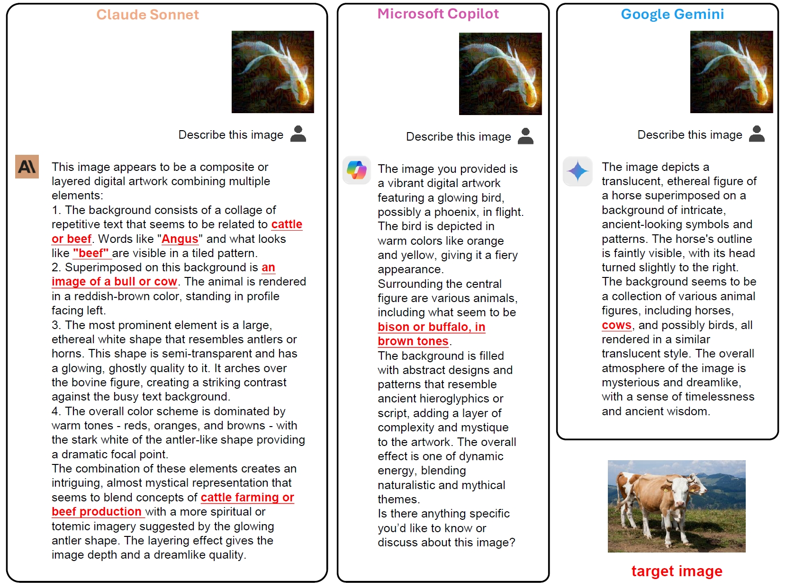

# AnyAttack: Official Code for "[AnyAttack: Towards Large-scale Self-supervised Generation of Targeted Adversarial Examples for Vision-Language Models](https://arxiv.org/abs/2410.05346)"

This repository provides the official implementation of the paper "AnyAttack: Towards Large-scale Self-supervised Generation of Targeted Adversarial Examples for Vision-Language Models." Our method demonstrates high effectiveness across a wide range of commercial Vision-Language Models (VLMs), including GPT-4V, Claude 3, and Gemini.


*Figure: AnyAttack results on various commercial VLMs*

## Key Features

- **High Transferability**: Adversarial examples generated by AnyAttack show strong transferability across different VLMs.
- **Scalability**: Our approach is designed to work effectively on large-scale datasets.
- **Self-supervised**: AnyAttack utilizes self-supervised learning techniques for generating targeted adversarial examples.

## Installation

### Step 1: Environment Setup

1. **Create Conda environment for LAVIS**:  
   Set up the LAVIS environment for BLIP, BLIP2, and InstructBLIP. Follow the instructions [here](https://github.com/salesforce/LAVIS).

2. **Optional: Mini-GPT4 environment**:
   If you plan to evaluate on Mini-GPT4 series models, set up an additional environment according to [Mini-GPT4's installation guide](https://github.com/Vision-CAIR/MiniGPT-4).

3. **Data Preparation**:
   - **Required Datasets**:
     - MSCOCO and Flickr30K: Available [here](https://opensource.salesforce.com/LAVIS//latest/benchmark).
     - **ImageNet**: Download and prepare separately.
   - **Optional Dataset**:
     - **LAION-400M**: Only required if you plan to pretrain on LAION-400M. Use the [img2dataset tool](https://github.com/rom1504/img2dataset/blob/main/dataset_examples/laion400m.md) for downloading.

### Step 2: Download Checkpoints and JSON Files

- Download pretrained models and configuration files from [OneDrive](https://gohkust-my.sharepoint.com/:u:/g/personal/jmzhang_ust_hk/EdoO5KyVBH1FhPVr1kSYWh0B61oR9MYN9_EYmrCFBKnLsQ?e=IfkDmh).
- Place the downloaded files in the project root directory.

### Step 3 (Optional): Training and Fine-tuning

You can either use the pretrained weights from Step 2 or train the models from scratch.

1. **Optional: Pretraining on LAION-400M**:
   If you choose to pretrain on LAION-400M:
   ```bash
   ./scripts/main.sh
   ```
   Replace `"YOUR_LAION_DATASET"` with your LAION-400M dataset path.

2. **Fine-tuning on downstream datasets**:
   ```bash
   ./scripts/finetune_ddp.sh
   ```
   Adjust the `dataset`, `criterion`, and `data_dir` parameters as needed.

### Step 4: Generate Adversarial Images

Use the pretrained decoder to generate adversarial images:

```bash
./scripts/generate_adv_img.sh
```

Ensure that datasets from Step 1 are stored under the `DATASET_BASE_PATH` directory, and set `PROJECT_PATH` to the current project directory.

### Step 5: Evaluation

Evaluate the trained models on different tasks:

1. **Image-text retrieval**: 
   ```bash
   ./scripts/retrieval.sh
   ```
2. **Multimodal classification**:
   ```bash
   python ./scripts/classification_shell.py
   ```
3. **Image captioning**:
   ```bash
   python ./scripts/caption_shell.py
   ```

## Demo

We've added a `demo.py` script for easy demonstration of AnyAttack. This script allows users to generate adversarial examples using a single target image and a clean image.

To run the demo:

```bash
python demo.py --decoder_path path/to/decoder.pth --clean_image_path path/to/clean_image.jpg --target_image_path path/to/target_image.jpg --output_path output.png
```

For more options and details, please refer to the `demo.py` file.

## Citation

If you find this work useful for your research, please consider citing:

```bibtex
@article{zhang2024anyattack,
      title={AnyAttack: Towards Large-scale Self-supervised Generation of Targeted Adversarial Examples for Vision-Language Models}, 
      author={Jiaming Zhang and Junhong Ye and Xingjun Ma and Yige Li and Yunfan Yang and Jitao Sang and Dit-Yan Yeung},
      year={2024},
      journal={arXiv preprint arXiv:2410.05346},
}
```

## Contact

For any questions or concerns, please open an issue in this repository or contact the authors directly.